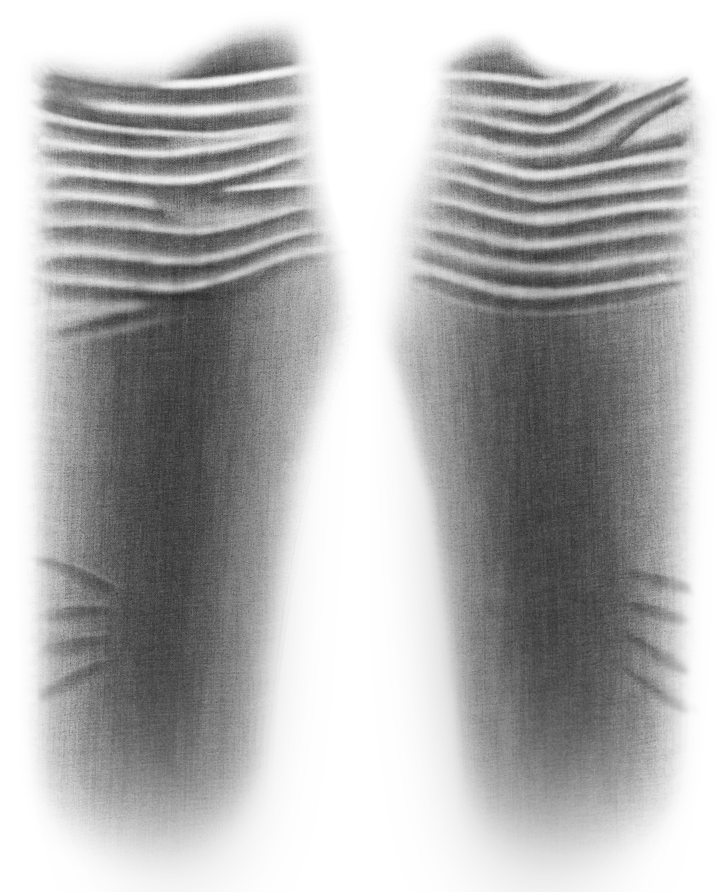
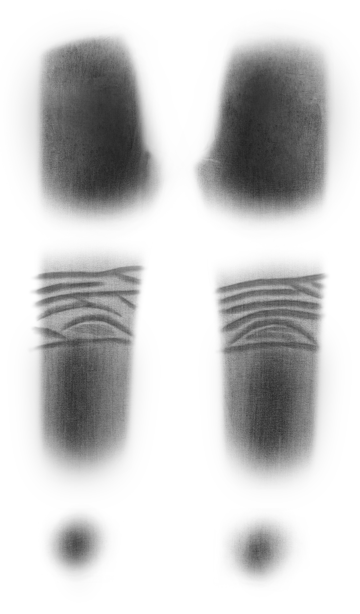

# 👖 Tecnología Láser - Calculadora de Producción

Este proyecto ayuda a calcular los tiempos y metas de producción para el área de láser.

## 🚀 Lavado: DELT
Parámetros de producción y referencias visuales para las máquinas Twin y Flexi.

### 📊 Metas de Producción
| Máquina | Pzas/Hora | 8 hrs | 15 hrs | 24 hrs | Intensidad |
| :--- | :---: | :---: | :---: | :---: | :---: |
| **Twin (Maniquí)** | 40 | 320 | 600 | 960 | 100 tpx |
| **Flexi (Maniquí)** | 48 | 384 | 720 | 1152 | 80 tpx |
| **Flexi (Mesa)** | 36 | 288 | 540 | 864 | 68 tpx |

### 📸 Referencias Visuales (Frente y Trasera)
| Diseño Láser (BMP) | Prenda Lavada |
| :--- | :--- |
|  |  |
|  |  |
---
